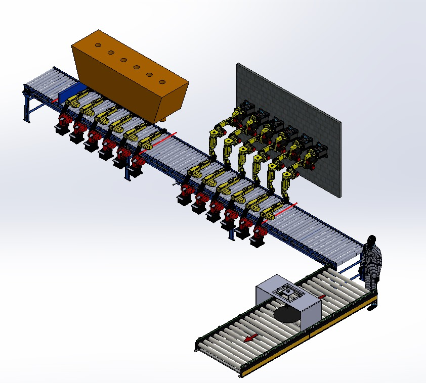
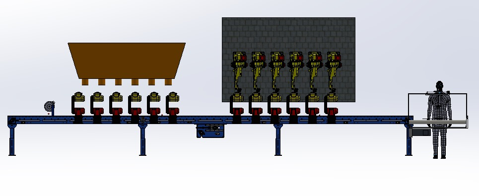
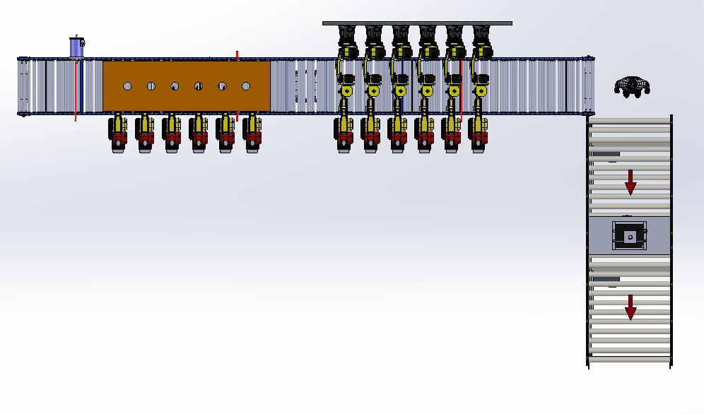

# 🏭 Industrial Bottle Filling & Packaging Automation

**An end-to-end industrial automation project designed for a 6-bottle filling, capping, and packaging line.**

This project encompasses the complete engineering lifecycle: from mechanical 3D design and cost analysis to electrical circuit design and PLC programming using **Siemens S7-1200** and **TIA Portal**.

---

## 📖 Table of Contents
1. [Project Overview](#-project-overview)
2. [System Architecture](#-system-architecture)
3. [Hardware & Components](#-hardware--components)
4. [Process Flow](#-process-flow)
5. [3D Design & Mechanical Layout](#-3d-design--mechanical-layout)
6. [Electrical & Power Design](#-electrical--power-design)
7. [PLC Programming (TIA Portal)](#-plc-programming-tia-portal)
8. [Budget Analysis](#-budget-analysis)

---

## 🎯 Project Overview

The goal of this project is to automate the liquid filling and packaging process to increase efficiency, hygiene, and traceability in industrial sectors such as food, beverage, and pharmaceuticals.

**Key Features:**
* **Dual Conveyor System:** Continuous flow management.
* **Station-Based Processing:** Filling, Capping, and Wrapping stations.
* **Smart Sensing:** IR/Optical sensors for precise positioning and counting.
* **Human-Machine Collaboration:** Semi-automatic design allowing operator intervention for quality control.

---

## ⚙️ System Architecture

The system operates on a cyclic logic controlled by a **Siemens S7-1214C PLC**.

1.  **Input Stage:** Empty bottles are fed into Conveyor 1 and counted (Batch size: 6).
2.  **Filling Station:** Bottles are clamped, and the filling robot dispenses liquid (Time-controlled).
3.  **Capping Station:** Caps are placed and tightened using a rotary actuator.
4.  **Transfer:** Operators inspect and move bottles to Conveyor 2.
5.  **Wrapping Station:** Bottles are detected, wrapped with stretch film, and counted as a finished package.

---

## 🛠 Hardware & Components

| Component | Quantity | Function |
| :--- | :--- | :--- |
| **PLC** | 1 | Siemens S7-1214C DC/DC/DC |
| **Expansion Module** | 2 | SM1222 – 16 DO Module |
| **HMI** | 1 | Siemens HMI Panel |
| **Servo Motors** | 18 | Siemens V90 (Conveyors & Robotic Arms) |
| **Sensors** | 4 | Sick GRL18S (Reflective Optical Sensor) |
| **Contactors** | 18 | Siemens 3TF40-10 |

---

## 🔄 Process Flow

The automation logic is time-window based, ensuring synchronized operations without complex interlocks.

* **T = 0-2s:** Gripper arms lock the bottles.
* **T = 2-4s:** Robot arm descends.
* **T = 4-8s:** Process execution (Filling / Capping / Wrapping).
* **T = 8-10s:** Robot arm ascends.
* **T = 10-12s:** Grippers release, conveyor moves.

---

## 🎨 3D Design & Mechanical Layout

The physical layout was modeled to ensure ergonomic operation and spatial efficiency.

### System Overview (Isometric View)

### Front View

### Top Layout View

### Additional Angles

---

## ⚡ Electrical & Power Design

Detailed wiring diagrams for PLC I/O and Motor Power Circuits.

### Power Circuit (Motors)

### PLC Wiring Diagram

---

## 💻 PLC Programming (TIA Portal)

The logic is implemented using Ladder Diagram (LAD). Below are key network examples showing the automation logic.

### Network Logic

---

## 💰 Budget Analysis

A comprehensive cost analysis was conducted for industrial feasibility.

| Item | Total Cost (Est.) |
| :--- | :--- |
| **PLC & Modules** | 33,600 TL |
| **HMI Panel** | 83,000 TL |
| **Servo Motors (x18)** | 248,400 TL |
| **Total System Cost** | **~415,638 TL** |

---

## 📄 Full Project Report

For detailed technical specifications, specific component datasheets, and operational algorithms, please refer to the full project report attached to this repository.

[📥 **Download Project Report (DOCX)**](Project-Report.pdf)

---

### 👨‍💻 Author
**Uğur Selim Okul**
*Electrical & Electronics Engineering Student*
* [GitHub Profile](https://github.com/UgurSelimOkul)
